# Miner Job Company

### Website layout design for a mine.

## The goal of the project

This is an example of a website layout for a coalmine.
SCSS variables, mixins and BEM methodology were used.
This is an application that presents a know-how from a website development workshop.

## Technologies Used:

- HTML,
- CSS,
- SASS preprocessor,
- JavaScript,
- Git Bush,
- Git,
- AOS (Animate On Scroll) - animation library.

## Tools:

- Node.js,
- NPM & dependences,
- AOS (Animate On Scroll),
- VSC (Visual Studio Code),
- Netlify

## Setup:

To run this project, start it in root directory using:
'npm start'

## Screenshots

Example screenshots:

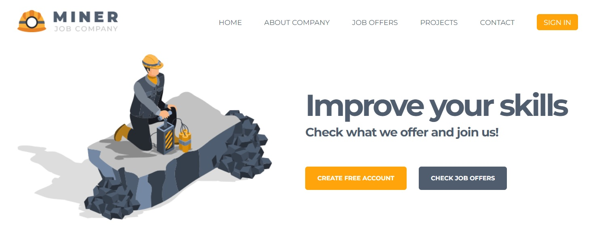
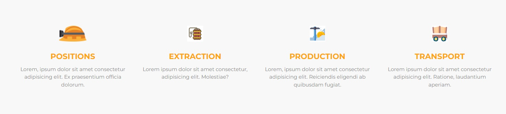
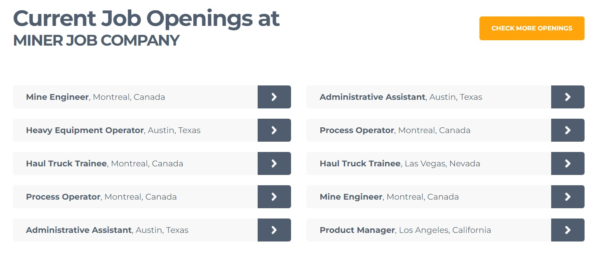
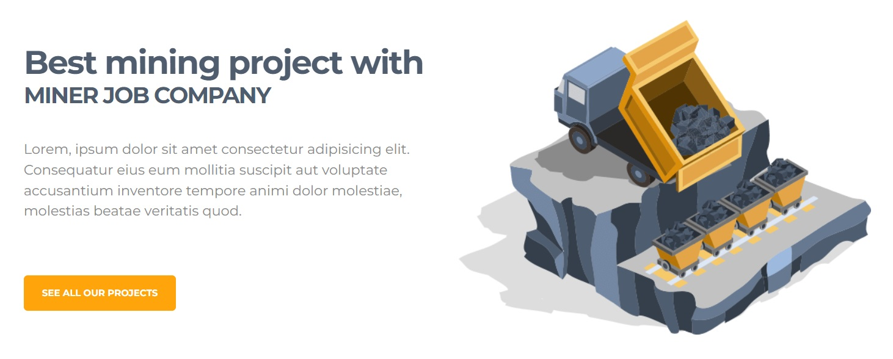
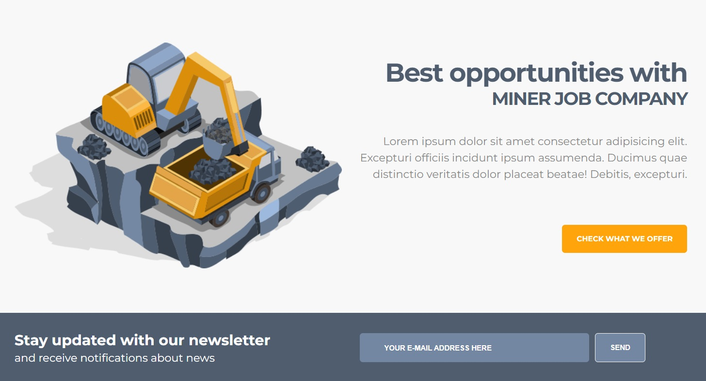
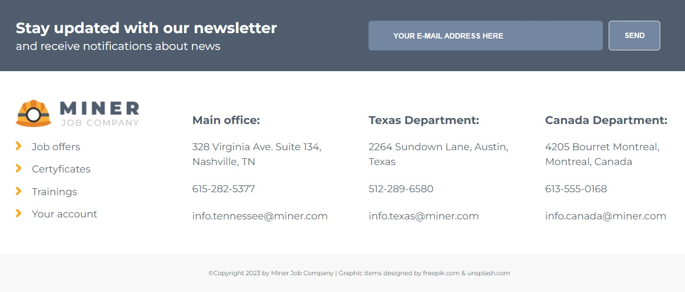
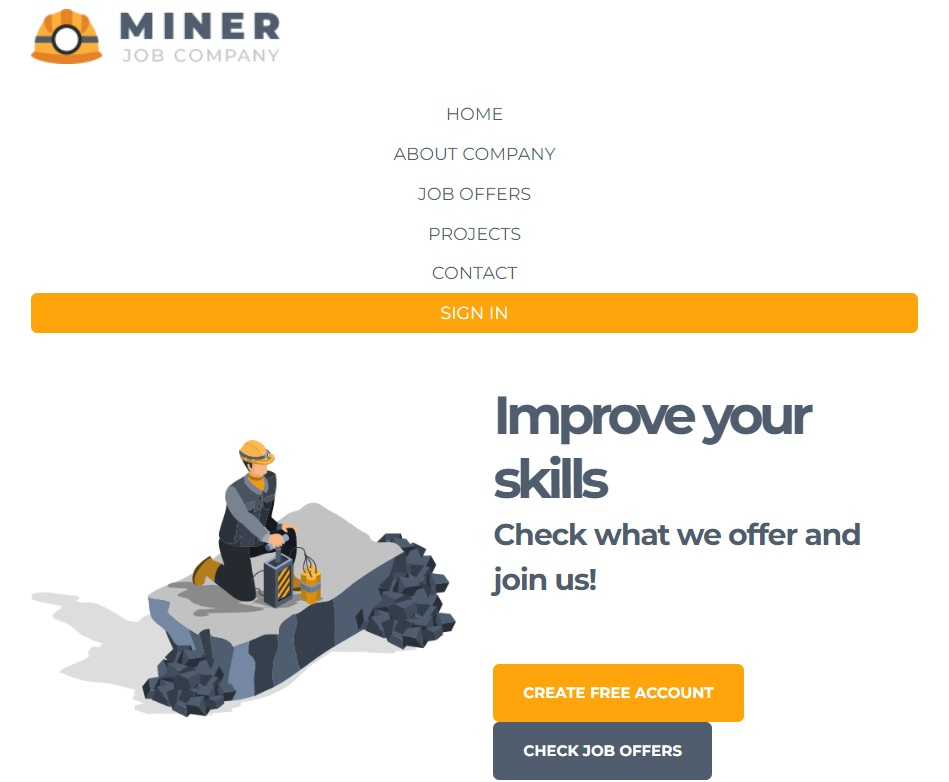
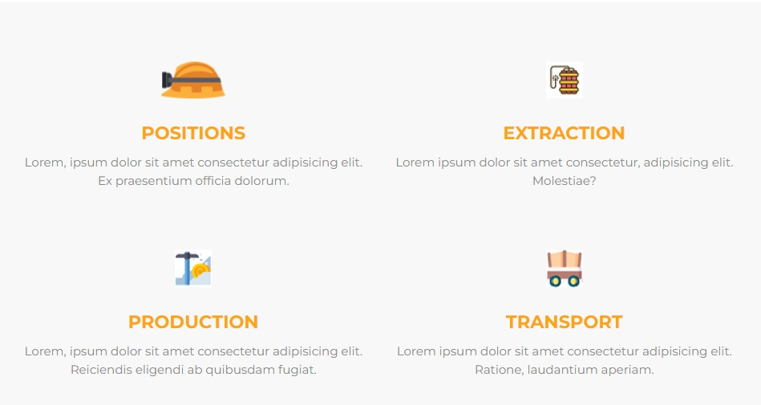
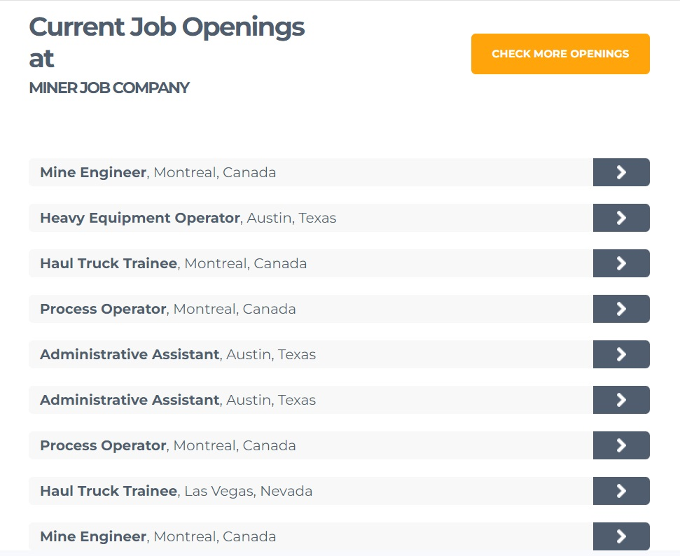
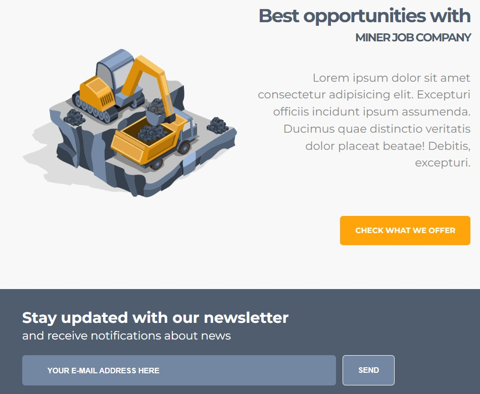
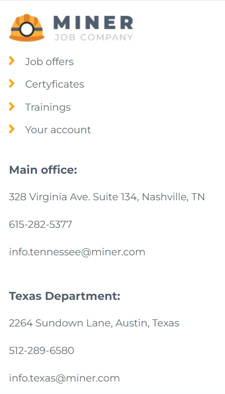
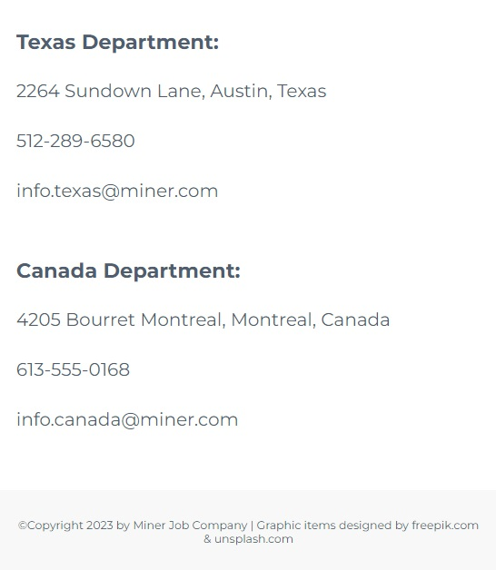

## Features

- SCSS styling & variables,
- Nesting of selectors,
- Partials and modules in SCSS,
- Mixins and extending,
- Use of BEM methodology,
- Graphic animation and even more.
